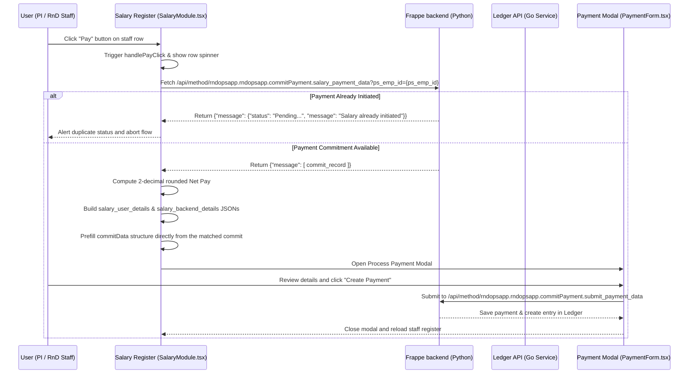

# Salary Payment Integration & Logics

This document describes the implementation architecture and underlying logics integrated inside the **Salary Module** (`SalaryModule.tsx`) to process staff salary payouts.

---

## 1. Payout Flow Overview

When a Principal Investigator (PI) or RnD Administrator initiates a salary payout for a Project Staff member, the system transitions from the Salary Register table to a pre-filled Ledger Payment Form modal using the following sequence:



---

## 2. Key Logics Playing Behind

### A. Duplicate Initiation Validation
Before checking ledger records or launching the modal, the system calls `salary_payment_data`. If the payout has already been submitted, it halts immediately to prevent double payouts:
*   **Trigger**: Clicking the emerald Pay button on a row.
*   **Logic**:
    ```typescript
    if (json?.message && !Array.isArray(json.message)) {
        if (json.message.message === "Salary already initiated" || json.message.status) {
            alert(`${json.message.message || "Salary already initiated"}\n\nStatus: ${json.message.status}`);
            return; // Aborts modal launching cleanly
        }
    }
    ```

### B. Direct Commit Resolution from API Response
All pre-filling commit details are returned directly in the array of commits from the backend `salary_payment_data` response:
*   **Endpoint**: `/api/method/rndopsapp.rndopsapp.commitPayment.salary_payment_data?ps_emp_id=2026TS0001`
*   **Primary Match (Backend API Response)**:
    ```json
    {
      "message": [
        {
          "projectNumber": "26RCHEMSP1122AKKU0002",
          "projectTitle": "Novel Pincer Catalytic Process for the Transformation of Ethanol to C4 Specialty Chemicals Using Advanced Microfluidic Reactors",
          "transactionCommitNumber": 7,
          "accountHeadId": 2,
          "transactionReceivedRefNumber": 8,
          "commitDate": "2026-04-23",
          "commitParticular": "Commitment for 202604160A00309",
          "refDetails": null,
          "commitAmount": 502150.0,
          "status": "COMMITTED",
          "billAmount": null,
          "moduleId": "11",
          "frapAppId": "202604160A00309"
        }
      ]
    }
    ```

If the whitelisted API successfully returns this array:
1.  **Commit Prefilling**: Properties like `transactionCommitNumber` prefill the `Commit Id` input, `projectNumber` prefills the `Project Ref Number`, `accountHeadId` prefills `Account Head`, and `frapAppId` (representing the interview/recruitment ID) prefills the underlying reference fields in the payment form modal.
2.  **Fallback Matching**: If the direct whitelisted call fails to return a matched commit, the system manually queries `/ledger-api/account-head-commit/by-status/COMMITTED` for a matching `moduleId: 11` commit, and falls back to a virtual pre-filled commit if none is found.

### C. Precision Rounding
To prevent floating-point decimals from being submitted (e.g., `16501.673548387094`), the raw Net Pay is intercepted at the entry point of `handlePayClick` and parsed to exactly **two decimal places**:
```typescript
const netPay = parseFloat(rawNetPay.toFixed(2));
```

---

## 3. Payload Structures in JSON

When submitting the payment, the following structures are attached to the `submit_payment_data` payload:

### A. Payout Period (`salary_year_month`)
A top-level parameter string formatted as `[Year]_[Month]` in lowercase:
*   *Example*: `"2026_june"`

### B. User Register Details (`salary_user_details`)
A JSON dictionary enclosing all staff calculations presented in the Salary Register statement:
```json
{
  "employee_id": "2026TS0001",
  "first_name": "Pabitra Maity",
  "email_id": "pabitramaity2612@gmail.com",
  "department": "Chemistry",
  "designation": "JRF (GATE)",
  "joining_date": "2026-05-18",
  "term_completion_date": "2027-04-16",
  "basic_salary": 37000.00,
  "hra": 7400.00,
  "working_days": 14,
  "pro_rata_basic": 16709.68,
  "pro_rata_hra": 3341.94,
  "pro_rata_medical": 564.52,
  "arrear": 0.00,
  "gross_pay": 20616.13,
  "hra_deduction": 3341.94,
  "medical_deduction": 564.52,
  "p_tax": 208.00,
  "ta": 0.00,
  "id_card_charge": 0.00,
  "electricity_bill": 0.00,
  "other_deduction": 0.00,
  "total_deduction": 4114.46,
  "net_pay": 16501.67,
  "comment": "Note...",
  "remarks": "Remarks..."
}
```

### C. Backend Source Details (`salary_backend_details`)
A JSON dictionary enclosing key system variables resolved from the backend API commit response and the staff register database:
```json
{
  "ps_emp_id": "2026TS0001",
  "scr_id": "202604160A00309",
  "project_no": "26RCHEMSP1122AKKU0002",
  "interview_id": "202604160A00309",
  "tenure_details": "",
  "current_basic_salary": 37000.00,
  "active_basic_salary": 37000.00
}
```
*   `scr_id` and `interview_id` are dynamically resolved from `commitFromApi.frapAppId` (which contains the recruitment contract ID).
*   `project_no` is dynamically resolved from `commitFromApi.projectNumber`.
*   `ps_emp_id`, `current_basic_salary` and `active_basic_salary` are derived from the active row's `StaffRecord`.
